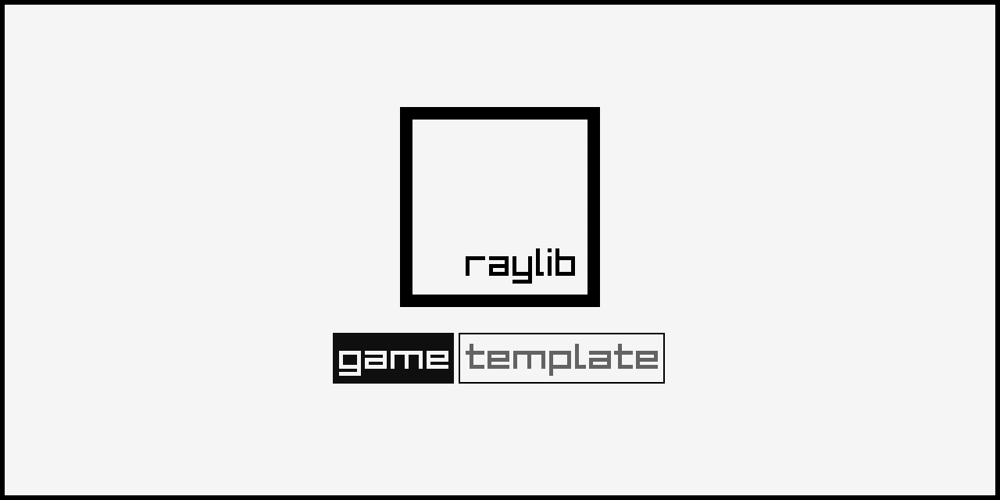

## Getting Started with building this

#### Linux
When setting up this project on linux for the first time, install the dependencies from this page:
([Working on GNU Linux](https://github.com/raysan5/raylib/wiki/Working-on-GNU-Linux))

Chose one of the follow setup options that fit in you development environment.

### Visual Studio

- After extracting the zip, the parent folder `raylib-game-template` should exist in the same directory as `raylib` itself.  So, your file structure should look like this:
    - Some parent directory
        - `raylib`
            - the contents of https://github.com/raysan5/raylib
        - `raylib-game-template`
            - this `README.md` and all other raylib-game-template files
- If using Visual Studio, open projects/VS2022/raylib-game-template.sln
- Select on `raylib_game` in the solution explorer, then in the toolbar at the top, click `Project` > `Set as Startup Project`
- Now you're all set up!  Click `Local Windows Debugger` with the green play arrow and the project will run.

### CMake

- Extract the zip of this project
- Type the follow command:

```sh
cmake -S . -B build
```

> if you want to configure your project to build with debug symbols, use the flag `-DCMAKE_BUILD_TYPE=Debug`

- After CMake configures your project, build with:

```sh
cmake --build build
```

- Inside the build folder is another folder (named the same as the project name on CMakeLists.txt) with the executable and resources folder.
- In order for resources to load properly, cd to `src` and run the executable (`../build/InfinityCastle/InfinityCastle`) from there.

- cmake will automatically download a current release of raylib but if you want to use your local version you can pass `-DFETCHCONTENT_SOURCE_DIR_RAYLIB=<dir_with_raylib>` 

## Infinity Castle



### Description

Procedurally generated Infinity Castle based on the movie: "Demon Slayer: The Infinity Castle Arc"

### Features

 - Procedurally generated 3D building
 - Free fly camera system

### Controls

Keyboard:
 - WASD/HJKL to move around
 - Mouse hover to control the looking directon of camera
 - Mouse scroll wheel to zoom in and out

### Screenshots

_TODO: Show your game to the world, animated GIFs recommended!._

### Developers

### Links

 - YouTube Gameplay: $(YouTube Link)
 - itch.io Release: $(itch.io Game Page)
 - Steam Release: $(Steam Game Page)

### License

This game sources are licensed under GPLv3 License. Check [LICENSE](LICENSE) for further details.

*Copyright (c) 2026 Mir Saheb Ali (https://github.com/mirsahebali)*
